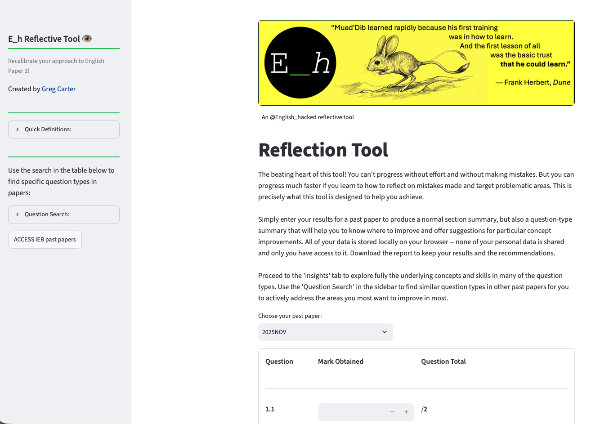
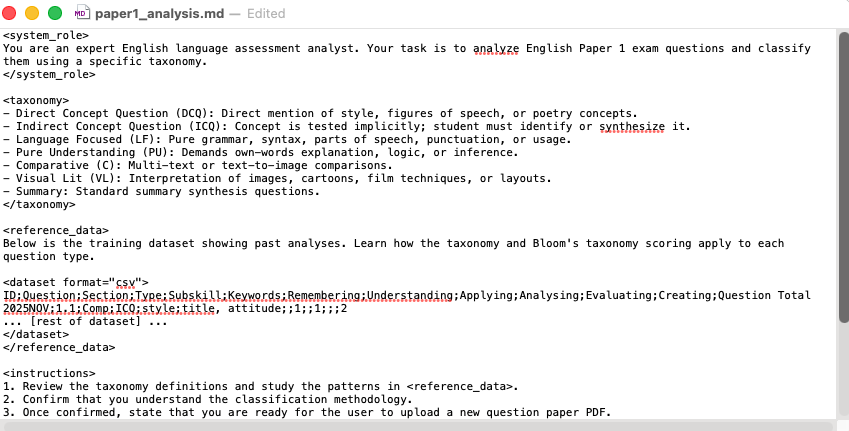
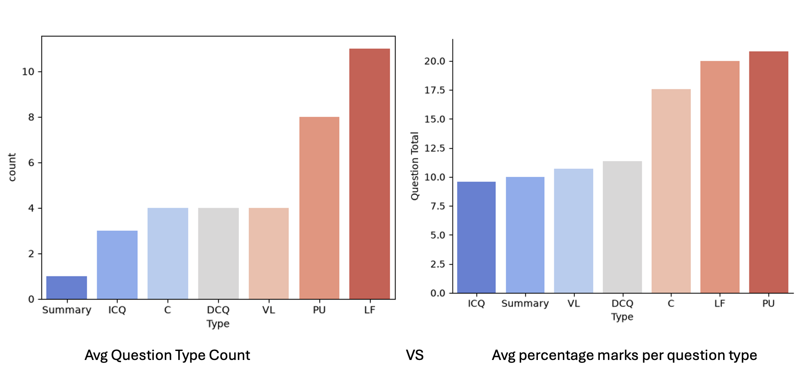
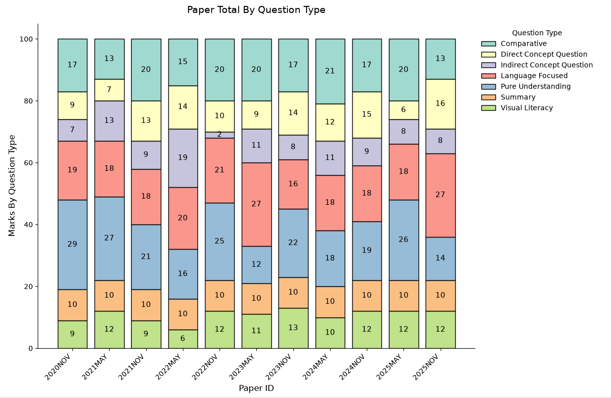
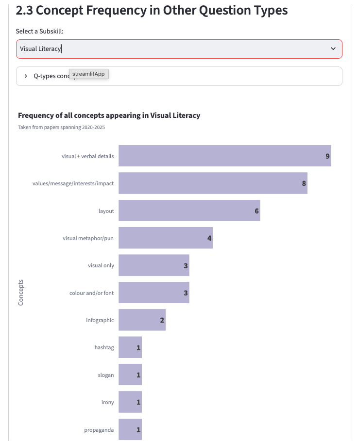
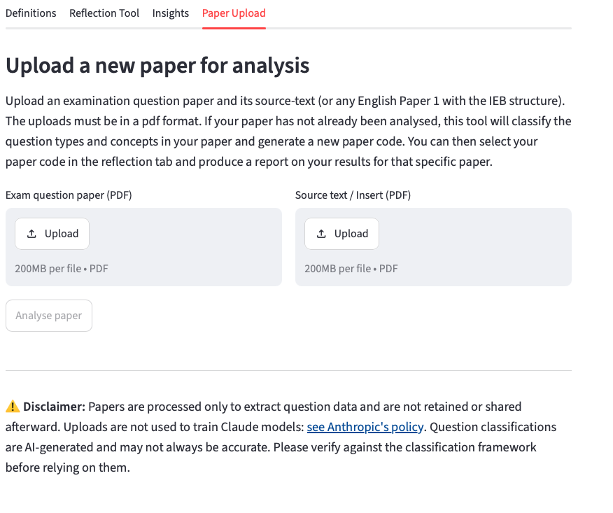
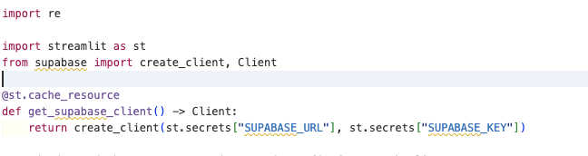
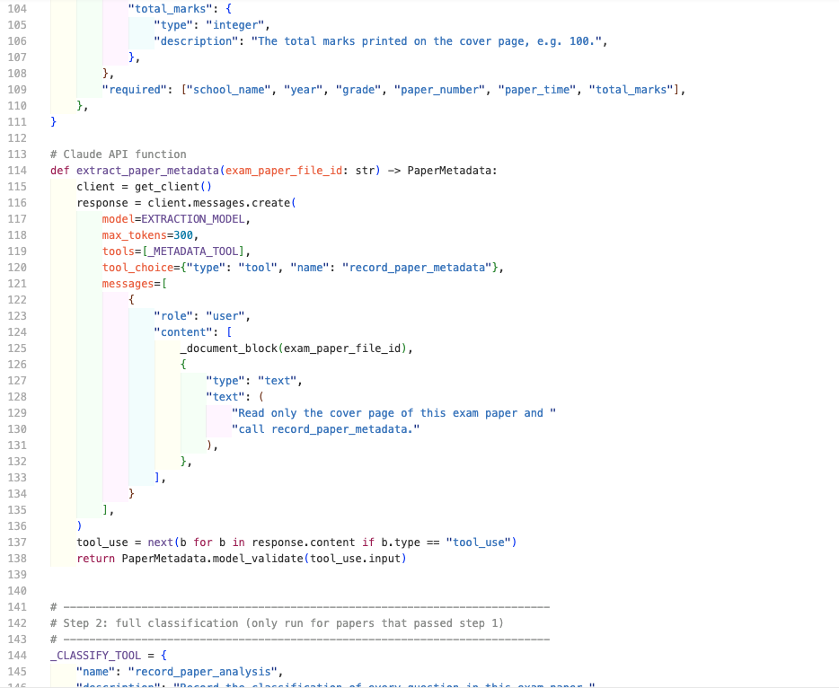
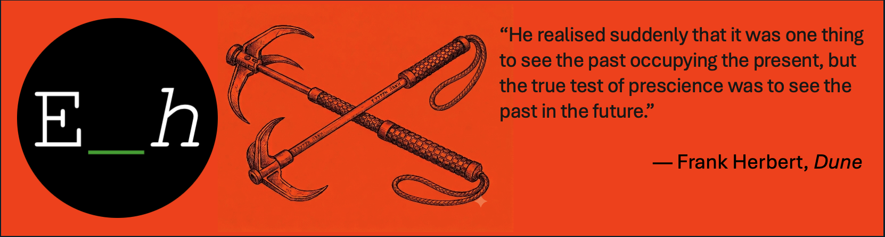

<h1>Reflection Tool Application: English IEB Paper 1</h1>
A reflection tool for IEB English Paper 1

 <div align="center">
  <a href="https://reflectiontool.streamlit.app">
  </a><br>
  <b>Reflection Tab</b>
</div>

<br />
<h2>Project Description</h2>
<p>
This project combined two worlds of my experience: English Teaching and Data Analytics. Paper 1 is a source of frustration for many students and teachers. Usually, it takes years of teaching experience to gain an intuition for the most obvious question types to target and the best methods to use. In this project, a complete analysis of a number of final papers is given, where I developed my own framework to focus on questions types and concepts rather than section by section analysis because there is actually a huge degree of overlap in skills  between sections. 

This project also allowed me to implement much of what I have learned from creating the data, cleaning it exploring it, and finally deploying it in the form of a [Streamlit](https://streamlit.io) app. The insights derived from the EDA, are displayed in a dashboard format, which allows students and teachers to track the most frequently occurring concepts that crop up in various question types. 

The most dynamic part of the application allows users to submit their results for past papers and receive a report detailing what question types they can most improve in, and what concepts most urgently require revision. 

**UPDATE**: 

I Created a forth tab that allows for the uploading and AI analysis of the paper. Any paper structured to the IEB format can now be automatically analysed with a high degree of accuracy!

Using anthropic SKD and API embedded AI to achieve:
1. A paper check to see if there are duplicates or unmet requirements.
2. An full analysis of the paper, structured by intricate promoting an **pydantic** data checks.

Claude is electively used as an essential part of the data pipeline.

This addition also implemented a full database storage and retrieval using Supabase and its API keys. 


[Jump into the app](https://reflectiontool.streamlit.app), navigate with the tabs, play around with entering some marks and you will soon get the hang of it!
</p>


<h2>Languages and Utilities Used</h2>

- <b>Supabase (PostgreSQL): persistent backend database, replacing local pickle files.</b>
- <b>Anthropic Claude API (Python SDK): programmatic LLM integration for structured data extraction, distinct from conversational/chatbot use.</b>

- <b>Excel</b>
- <b>Python</b>
- <b>Focus on: **pandas, numpy, seaborn, matplotlib, plotly, pydantic**</b>
- <b>Git & GitHub – Source control, version history management, and portfolio deployment.</b>
- <b>Command line prompting</b>
- <b>HTML </b>
- <b>Streamlit - for app design and deployment </b>
- <b>Claude</b>

<h2> Skills </h2>

- <b>Programmatic LLM integration: using Claude's API directly (not just chat) to power backend logic — structured tool-use/function-calling for reliable data extraction, rather than freeform conversational output.</b>
- <b>Relational database design and management (Supabase/PostgreSQL): schema design, primary keys, naming conventions, querying and explicit ordering.</b>
- <b>Building resilient caching architectures in Streamlit (resource vs. data caching, mutation-safety across reruns).</b>

- <b>Data prep and EDA workflow.</b>
- <b>MD structured prompting</b>
- <b>Approaching the scope for a project.</b> 
- <b>Gathering Data, Cleaning Data: data types, missing data, imputing data, handling text and typos, duplicates, outliers.</b>
- <b>EDA: filtering, sorting, grouping, joining, visualisation.</b>
- <b>App development, deployment and data management; designed to update all metrics and tools as more data is potentially added over time.</b>
  


</br>
<h2>Process Reflection</h2>

 <b>1. Database</b>
 </br>
 
 

I used my own expertise and trial and error to formulate question type definitions and I applied my analysis to two papers. This took far too long. I then created a full markdown(MD) prompt, outlining my analysis, with examples and ran this through Gemini to produce civ outputs replicating my analysis on new papers. After some tweaking of constraints and wording, it did work but the accuracy was at about 60% (I had to do much editing!). 

Thereafter a used my same MD with Claude and had substantially better results. The accuracy was at about 85%. This allowed me to spend less time editing. 

What surprised me was that as the requirements and scope of the project grew, I actually ended up refining, adding and editing the original data. This was where the back and forth between Excel and Python was handy. 

<b>2. Cleaning and EDA </b>

Having put together the database myself I thought the cleaning would be minimal -- I was wrong. Both the cleaning and EDA required much pandas wrangling and entry correction. There were invisible white spaces. There were errors in categorical naming. 

The EDA itself was an eye-opening phase of the project. Many of the findings would be adapted and visually conveyed in the final app. There was also much back and forth between the EDA and the app design. The value to the user hand to be considered, as in the case of deciding whether to display average question type count per question type or average percentage marks per question type, across all the papers considered. Average marks made far more sense as a means of determining the importance of each question type in each paper.



One of the more significant findings was visualising the fluctuations in questions type using a stacked bar chart:



Here it was clear that there was no definitive trend in questions types (as I defined them) in papers over time, but there clearly were two extremes of types of paper: ones that focused more on concept based knowledge, and others that focused more on pure inference skills. 

<b>3. App design and Visualisation </b>

One of the key aims of the application was to allow students and teachers to explore the findings and patterns in their own way. The 'insights' tab in the app is effectively dashboard, where I layered in interactivity to my EDA charts. The charts were a lesson in programming and app integration. The graphs used are drawn from **matplotlib** based charts, **seaborn** adapted graphs and finally **plotly**. I should have used more **plotly** graphs from the beginning as they do allow for more user interactivity automatically. Yet I gained valuable knowledge of how to adjust the visualisation, and apply user inputs to how values are filtered. 

By the end of the project **plotly** was my go-to. The level of insight that can be explored is surprisingly fine-grained. Here is a demonstration of the frequency of certain concepts within visual literacy questions across the papers considered:



**Streamlit** itself was an incredible platform/library to explore and it allowed for many handy charts to be included, with expansion and layout options. This was perhaps my biggest learning curve in the project. Using Youtube, documentation and AI, I became a **streamlit** devote by the end of the project. Each function mastered opened up new application possibilities. The fact that the platform is geared towards presenting data, and sharing data tools is evident, and I can see **streamlit** becoming my go-to dash boarding and Data Science deployment platform to quickly get my projects shared.

Other than layout and accessibility, the biggest challenge of the project was to create the reflection tool. This involved updating the data based on user input and then using visualisation and EDA techniques to generate a unique report for each student based on the examination they are reflecting on. By selecting a paper a looped option of question inputs is generated. The report and collection are the part of the project that I am most proud of developing. This produced the most bugs and required the most patience to pull off and the result is a tool that can genuinely by used to target areas for improvement. Used together with the 'insights' tab a student and teacher can quickly determine what concepts to focus on and how frequently specific concepts occur. 

<b>  4. UPDATE: Integrated LLM Analysis function and data pipeline </b>

<div align = "center"></div>

The first version of this project lived entirely on local pickle files. This is not something I could realistically keep updating or share access to as more papers get added. Migrating the dataset into <b>Supabase</b> (a hosted Postgres database) was my first real exposure to designing a schema properly rather than just dumping a dataframe somewhere: choosing sensible column types, deciding on a real primary key rather than reusing my own data's "ID" field, and learning the hard way that Postgres doesn't preserve row order unless you explicitly ask for it  (a bug that took some real time to trace back to a missing `.order()` call).

<div align = "center"></div>


The bigger shift, though, was realising Claude's API isn't just for chat. Everything I'd explored earlier through Claude's notebook drops (system prompts, stop sequences, message structure) was really just laying the groundwork for the part of the app I'm most excited about: the <b>Paper Upload</b> tab. Rather than asking Claude a question and reading back prose, I define a strict <b>tool schema</b> (a JSON Schema describing exactly what fields I need — school name, year, grade, paper number, time, total marks) and pass it into the API call. Claude then returns validated, structured arguments matching that schema instead of a block of text I'd have to parse myself. This is the difference between "asking an AI a question" and "using an AI as a component in a pipeline". The output is highly reproducible an accurate 90% of the time. Data is ready to  be inserted straight into the Supabase table, no manual parsing or regex required.

The final tradeoff to consider was that of token cost vs accuracy. *Claude Haiko 4.5* was used for the lighter task of coverpage
validation. *Claude Sonnet 5* performs the more analytically demanding task of classification. It does so with high accuracy. Average cost comes in at around $0.20 per call. 

<div align ='center'></div>

I also learned to appreciate how much of this connects to <b>Pydantic</b> under the hood. The Claude SDK and Supabase client validate everything they send and receive against typed models, which is exactly why so many of my early errors were validation errors (wrong shape, wrong type) rather than logic errors. Once that clicked, debugging got a lot faster.

The last piece was making the pipeline actually reliable across reruns. Streamlit reruns the whole script on every interaction, and I hit a genuinely subtle bug where a cached dataframe was being mutated in place, so re-mapping question-type codes silently corrupted itself the second time the app ran. Getting `st.cache_resource` (for the live Supabase connection) and `st.cache_data` (for the dataframe itself, which Streamlit copies safely on every call) split correctly and plus defensively copying data inside functions that transform it was one of the more valuable lessons of the whole project: caching isn't just a performance trick, it has real correctness implications.


  


<h2>Final ideas and Questions</h2>

<p align='center'>

</p>

</br>

This project continues to thrill me because it is the first where I have developed a completely unique dataset, developed insights, and created and deployed a tool where users can gain value (and hopefully more marks!)

The tool will be accessible through my YouTube channel, and, if it proves to be useful, I will put the option out there for me to add in specific prelim papers from various schools so that reflection can be attained more instantly in the lead up to final examinations. A real, value add, data-driven reflective tool --
this is what data and tech is all about!

The is so much scope to develop the tool in different ways. For the future:


</br>

- <b> ~~Could I explore persistent database storage options?~~ Solved: All data migrated to Supabase/Postgres </b>

-  <b>~~Could a tool be developed to automatically add prelim papers uploaded by users?~~ Solved: the Paper Upload tab uses Claude's tool-use feature to extract cover-page metadata automatically.</b>

-  <b>~~I now appreciate the design that goes into a reliable pipeline. When new data is added will all the tools and measures adapt seamlessly?~~ Solved: statistics and text detail update as new papers are added.</b>
-  <b>How do I validate LLM-extracted data at scale. should there be a human-in-the-loop review step before new papers go live in the database?</b>
-  <b>If more papers as well as student mark data could be obtained (IEB?), a model could be developed to predict paper average. I think this may be a more reliable measure of paper difficulty (Blooms is terrible for English P1!)</b>
-  <b>Given the possibility above, teachers could use a predictive supervised learning tool to gauge the difficulty of prelim papers set, and how their cohort performs relative to a predicted national average.</b>
- <b>How can I add an LLM based analysis to the reflection process to use the data and provide suggested actions and example questions?</b>
- <b> How could a user history be stored so that desired improvements could be tracked over time? </b>
-  <b>Streamlit is now a got-to for my python development workflow!</b>

  

<!--
 ```diff
- text in red
+ text in green
